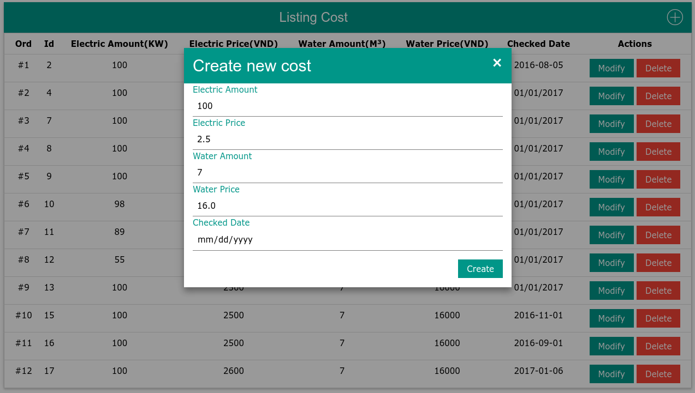
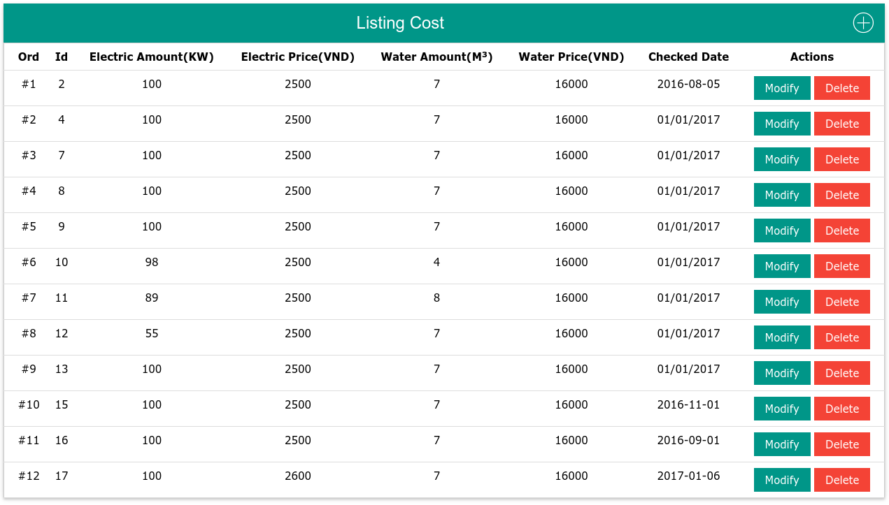

# famcost
Sample CRUD use Go with sqlite

# Introduction
This sample aim to practice while I'm learning Go, It use built-ins Go's packages such as `net/http`, `database/sql`, `strconv`, 
`html/template` and use a third party packge https://github.com/mattn/go-sqlite3

# Installation
- Setup environment official here https://golang.org/doc/install
- Clone and change to `famcost` folder ren run `go get` to install dependencies.
- Create table `
CREATE TABLE cost
(
    id INTEGER PRIMARY KEY NOT NULL,
    electric_amount INTEGER,
    electric_price INTEGER,
    water_amount INTEGER,
    water_price INTEGER,
    checked_date TEXT
);
`
- Run local `go run *.go`
- Docker build `docker build -t famcost .`
- Docker run `docker run --publish 6666:3333 --name famcost --rm famcost`

# Screen shots

# TODOs
- Add simple loggin.
- Add simple Rest api.
- Add test case.

